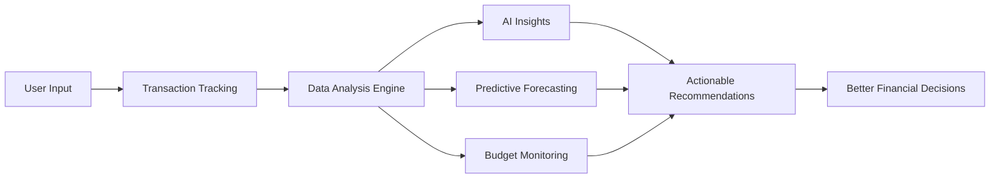

<div align="center">

# 💰 FinSight

### Take Control of Your Financial Future

**An intelligent personal finance platform that transforms financial chaos into clarity.**

[](https://fin-sight-nu.vercel.app/)
[](https://nextjs.org/)
[](https://www.typescriptlang.org/)
[](https://supabase.com/)
[](LICENSE)

[Features](#-key-features) • [Live Demo](https://fin-sight-nu.vercel.app/) • [Installation](#-installation--setup) • [Documentation](#-usage--examples) • [Contributing](#-contributing-guide)

</div>

---

## 🎯 Project Overview

FinSight is a **production-ready personal finance intelligence platform** that empowers individuals to understand, optimize, and control their financial health. Built with modern web technologies and AI-powered insights, FinSight transforms raw financial data into actionable intelligence.

Unlike basic budgeting apps, FinSight provides:
- **AI-Powered Financial Insights** using advanced analytics
- **Multi-Currency Global Support** for international users
- **Predictive Forecasting** to anticipate future cash flow
- **Debt Optimization Strategies** with snowball/avalanche analysis
- **Enterprise-Grade Security** with row-level data protection

---

## 🔥 The Problem

Managing personal finances is overwhelming:

❌ **Fragmented Financial Data** – Accounts across multiple banks, cards, and wallets  
❌ **No Clear Picture** – Can't see total net worth or spending patterns  
❌ **Manual Tracking** – Spreadsheets are tedious and error-prone  
❌ **No Predictive Insights** – Can't forecast future financial health  
❌ **Reactive, Not Proactive** – Learn about problems too late  
❌ **Multi-Currency Confusion** – International users struggle with conversions  

**Result:** Financial stress, missed savings opportunities, and poor decisions.

---

## ✅ The Solution

FinSight consolidates your entire financial life into one intelligent platform:

✔️ **Unified Dashboard** – All accounts, transactions, and goals in one place  
✔️ **AI Financial Analyst** – Get personalized insights and recommendations  
✔️ **Predictive Forecasting** – See 3-6 month cash flow projections  
✔️ **Smart Budget Management** – Automated tracking with overspending alerts  
✔️ **Debt Payoff Strategies** – Compare snowball vs avalanche methods  
✔️ **Multi-Currency Native** – Seamless support for 9 major currencies  
✔️ **Privacy-First Design** – Your data stays yours, encrypted and secure  

---

## 🏗️ How It Works



### System Architecture

**Frontend**  
Next.js 14 (App Router) + TypeScript + TailwindCSS → Server-side rendering for optimal performance

**Backend**  
Next.js API Routes (Serverless) → PostgreSQL (Supabase) → Row-Level Security (RLS)

**AI Layer**  
OpenRouter API (Claude 3 Sonnet / GPT-4) → Anonymized financial analysis → Actionable insights

**Automation**  
Vercel Cron Jobs → Scheduled insight generation → Recurring transaction processing

---

## ⚡ Key Features

### 💳 **Account Management**
Track all your financial accounts in one unified dashboard.

- Multiple account types: Bank, Credit Card, Investment, E-Wallet, Loan, Cash
- Multi-currency support (USD, EUR, GBP, IDR, JPY, SGD, MYR, CNY, THB)
- Automatic balance calculations
- Hidden/archived accounts for decluttering
- Net worth calculation (Assets - Liabilities)

### 💸 **Smart Transaction Tracking**
Every dollar accounted for, automatically.

- Income, Expense, and Transfer transaction types
- Category splits (one transaction → multiple categories)
- Automatic balance updates via database triggers
- Merchant tracking and notes
- Advanced filtering and search
- Bulk operations support

### 🎯 **Intelligent Budget Management**
Stay on track with AI-powered budget alerts.

- Monthly, weekly, yearly, or custom budget periods
- Category-based spending limits
- Automatic spent calculation linked to transactions
- Carryover unused budget to next period
- Over-budget detection with severity alerts
- Visual progress bars and notifications

### 🏆 **Financial Goals**
Set goals, track progress, achieve dreams.

- Savings goal creation with target amounts
- Deadline tracking with milestone visualization
- Completion simulation (months to goal)
- Required monthly savings calculator
- Goal recommendations based on financial health

### 💰 **Debt Payoff Optimizer**
Get out of debt faster with proven strategies.

- Track credit cards, loans, mortgages, and personal debt
- Interest rate calculations (simple & compound)
- **Snowball Strategy** – Pay smallest balances first for quick wins
- **Avalanche Strategy** – Pay highest interest rates first for maximum savings
- Side-by-side strategy comparison
- Payoff schedule generation
- Minimum payment tracking

### 🤖 **AI Financial Analyst**
Your personal finance advisor, powered by AI.

- Spending anomaly detection (Z-score analysis)
- Behavior trend analysis (month-over-month patterns)
- Category overuse warnings
- Lifestyle inflation detection
- Budget risk assessment
- Actionable recommendations in plain language
- Severity classification (info, warning, critical, positive)

### 📈 **Predictive Forecasting**
See the future of your finances before it happens.

- 3-6 month cash flow projections
- End-of-month balance predictions
- Daily balance forecasts with confidence intervals
- Scenario analysis (optimistic, realistic, pessimistic)
- Risk level classification (low, medium, high, critical)
- Historical pattern analysis (90-day lookback)

### 🌐 **Multi-Currency System**
Go global without the conversion headaches.

| Currency | Symbol | Region |
|----------|--------|--------|
| USD | $ | United States |
| EUR | € | European Union |
| GBP | £ | United Kingdom |
| IDR | Rp | Indonesia |
| JPY | ¥ | Japan |
| SGD | S$ | Singapore |
| MYR | RM | Malaysia |
| CNY | ¥ | China |
| THB | ฿ | Thailand |

- Real-time exchange rates (1-hour cache)
- Automatic currency conversion for transfers
- Multi-currency account support

### ⚙️ **Automation & Recurring Transactions**
Set it and forget it.

- Recurring transaction templates (daily, weekly, monthly, yearly, custom)
- Automated transaction creation via cron jobs
- Scheduled insight generation
- Automatic balance recalculation
- Database triggers for data consistency

---

## 🛠️ Technology Stack

<table>
<tr>
<td valign="top" width="50%">

### **Frontend**
- **Framework:** Next.js 14 (App Router)
- **Language:** TypeScript 5.3
- **Styling:** TailwindCSS 3.4
- **UI Components:** Custom component library
- **Charts:** Recharts
- **Icons:** Lucide React
- **Date Handling:** date-fns

</td>
<td valign="top" width="50%">

### **Backend**
- **API:** Next.js API Routes (Serverless)
- **Database:** PostgreSQL (Supabase)
- **Authentication:** Supabase Auth
- **ORM:** Supabase JS Client
- **Cron Jobs:** Vercel Cron
- **AI:** OpenRouter (Claude 3 Sonnet, GPT-4)

</td>
</tr>
</table>

### **Infrastructure**
- **Hosting:** Vercel (Edge Network)
- **Database Hosting:** Supabase Cloud
- **CDN:** Vercel Edge CDN
- **Environment:** Node.js 18+

### **Security**
- Row-Level Security (RLS) on all database tables
- JWT-based authentication
- Environment variable encryption
- Server-side only AI API calls
- No sensitive data in client bundles

---

## 📦 Installation & Setup

### Prerequisites

Before you begin, ensure you have:
- **Node.js 18+** installed ([Download](https://nodejs.org/))
- **Git** installed
- A **Supabase** account ([Sign up free](https://supabase.com))
- An **OpenRouter** API key ([Get one here](https://openrouter.ai))

### Step 1: Clone the Repository

```bash
git clone https://github.com/AldyLoing/FinSight.git
cd FinSight
```

### Step 2: Install Dependencies

```bash
npm install
```

### Step 3: Setup Supabase Database

1. Create a new project at [supabase.com](https://supabase.com)
2. Wait for database initialization (2-3 minutes)
3. Go to **SQL Editor** in your Supabase dashboard
4. Execute the SQL files in this order:

```bash
# Copy and run these files in Supabase SQL Editor:
# 1. scripts/supabase/schema.sql      (Creates tables)
# 2. scripts/supabase/rls.sql         (Sets up security)
# 3. scripts/supabase/functions.sql   (Creates triggers)
```

5. Go to **Settings → API** to get your credentials

### Step 4: Get OpenRouter API Key

1. Visit [openrouter.ai](https://openrouter.ai)
2. Sign up/Sign in
3. Navigate to **Keys → Create New Key**
4. Copy your API key (starts with `sk-or-v1-`)

### Step 5: Configure Environment Variables

Create a `.env.local` file in the root directory:

```bash
cp .env.example .env.local
```

Update with your credentials:

```env
# Supabase Configuration
NEXT_PUBLIC_SUPABASE_URL=https://xxxxx.supabase.co
NEXT_PUBLIC_SUPABASE_ANON_KEY=eyJhbGc...
SUPABASE_SERVICE_ROLE_KEY=eyJhbGc...

# OpenRouter AI
OPENROUTER_API_KEY=sk-or-v1-...

# Cron Secret (generate a random string)
CRON_SECRET=your-super-secret-string-123

# App URL
NEXT_PUBLIC_APP_URL=http://localhost:3000
```

### Step 6: Run the Development Server

```bash
npm run dev
```

Open [http://localhost:3000](http://localhost:3000) in your browser.

### Step 7: Create Your Account

1. Navigate to **Sign Up** page
2. Create your account
3. Start adding accounts and transactions!

---

## 🚀 Usage & Examples

### Adding Your First Account

```typescript
// Navigate to /accounts
// Click "Add Account"
{
  name: "Main Checking",
  type: "bank",
  currency: "USD",
  initial_balance: 5000.00,
  icon: "💰",
  color: "#10b981"
}
```

### Recording a Transaction

```typescript
// Navigate to /transactions
// Click "Add Transaction"
{
  type: "expense",
  amount: 120.50,
  category: "groceries",
  description: "Weekly grocery shopping",
  account_id: "your-account-id",
  date: "2026-01-13"
}
```

### Creating a Budget

```typescript
// Navigate to /budgets
// Click "Create Budget"
{
  name: "Monthly Groceries",
  category: "groceries",
  amount: 500.00,
  period: "monthly",
  start_date: "2026-01-01"
}
```

### Setting a Financial Goal

```typescript
// Navigate to /goals
// Click "New Goal"
{
  name: "Emergency Fund",
  target_amount: 10000.00,
  current_amount: 2000.00,
  deadline: "2026-12-31",
  category: "savings"
}
```

### API Example (Fetching Accounts)

```typescript
// Server Component
import { createClient } from '@/lib/db-server';

export default async function AccountsPage() {
  const supabase = createClient();
  const { data: accounts } = await supabase
    .from('accounts')
    .select('*')
    .order('created_at', { ascending: false });

  return <div>{/* Render accounts */}</div>;
}
```

---

## 💼 Use Cases

### 👤 **Individual Users**
- Track personal spending and savings
- Plan for major purchases (car, house, wedding)
- Get out of debt faster with optimization strategies
- Build emergency funds and retirement savings

### 👨‍👩‍👧‍👦 **Families**
- Manage household budget collaboratively
- Track shared expenses and bills
- Save for children's education
- Monitor family net worth

### 💼 **Freelancers & Self-Employed**
- Separate personal and business finances
- Track irregular income streams
- Plan for quarterly tax payments
- Forecast cash flow for lean months

### 🌍 **International Professionals**
- Manage finances across multiple countries
- Handle multi-currency income and expenses
- Track investments in different currencies
- Simplify cross-border financial planning

### 🎓 **Students**
- Budget limited resources effectively
- Track student loans and repayment
- Save for post-graduation goals
- Build healthy financial habits early

---

## 🗺️ Roadmap

### ✅ Phase 1: Core Features (Completed)
- [x] Account management
- [x] Transaction tracking
- [x] Budget management
- [x] Goal setting
- [x] Debt tracking
- [x] Multi-currency support
- [x] AI insights
- [x] Forecasting engine

### 🚧 Phase 2: Enhanced Intelligence (In Progress)
- [ ] Bank account integration via Plaid/Teller
- [ ] Receipt scanning with OCR
- [ ] Investment portfolio tracking
- [ ] Tax estimation and reporting
- [ ] Mobile app (React Native)
- [ ] Advanced charting and analytics

### 🔮 Phase 3: Collaboration & Scale (Planned)
- [ ] Multi-user support (family accounts)
- [ ] Shared budgets and goals
- [ ] Financial advisor integration
- [ ] Export to QuickBooks/Xero
- [ ] Subscription management tracker
- [ ] Bill payment reminders

### 🌟 Phase 4: Premium Features (Future)
- [ ] AI-powered investment advice
- [ ] Automated savings optimization
- [ ] Credit score monitoring
- [ ] Real estate portfolio tracking
- [ ] White-label solution for financial advisors

---

## 🌍 Impact

### **Economic Empowerment**
FinSight democratizes access to financial intelligence tools that were previously only available to wealth management clients.

### **Financial Literacy**
By providing clear, actionable insights, FinSight educates users about personal finance principles and best practices.

### **Debt Reduction**
The debt optimization calculator helps users save thousands in interest payments and achieve financial freedom faster.

### **Privacy & Data Ownership**
Unlike traditional banks, users maintain complete control and ownership of their financial data.

### **Global Accessibility**
Multi-currency support enables financial management for people across borders, supporting international workers and digital nomads.

---

## 🎯 Target Market

### **Primary Markets**
- **Millennials & Gen Z** (25-40 years old) – Tech-savvy, financially conscious
- **Freelancers & Gig Workers** – Irregular income, need cash flow forecasting
- **International Professionals** – Multi-currency needs, cross-border finances
- **Small Business Owners** – Separate business/personal finances

### **Geographic Focus**
1. **Southeast Asia** (Indonesia, Singapore, Malaysia, Thailand)
2. **North America** (United States, Canada)
3. **Europe** (UK, EU countries)

### **Market Size**
- **Global Personal Finance Software Market:** $1.2B (2023) → $1.9B (2030)
- **TAM (Total Addressable Market):** 500M people worldwide
- **SAM (Serviceable Available Market):** 50M English-speaking users
- **SOM (Serviceable Obtainable Market):** 500K users (Year 1 goal)

---

## 💡 Why This Matters

### **The Financial Wellness Crisis**
- 60% of Americans live paycheck to paycheck
- Average household debt: $145,000+ (mortgages, student loans, credit cards)
- Only 39% of Americans could cover a $1,000 emergency

### **FinSight's Mission**
Transform financial chaos into clarity, empowering everyone to achieve financial wellness regardless of income level.

### **Core Beliefs**
1. **Financial data should be owned by individuals, not corporations**
2. **AI should democratize financial advice, not gatekeep it**
3. **Privacy is a fundamental right, not a premium feature**
4. **Financial literacy should be accessible to everyone**

---

## 🌟 Vision & Mission

### **Vision**
A world where everyone has the tools, knowledge, and confidence to achieve financial wellness.

### **Mission**
Empower 1 million people to take control of their financial future by 2028 through intelligent, privacy-first financial management tools.

### **Values**
- 🔐 **Privacy First** – Your data belongs to you
- 🎯 **Clarity Over Complexity** – Simple, actionable insights
- 🤝 **Inclusivity** – Financial tools for everyone, everywhere
- 🚀 **Continuous Innovation** – Always improving, never stagnant
- 💚 **Ethical AI** – Responsible use of artificial intelligence

---

## 🤝 Contributing Guide

We welcome contributions from developers, designers, financial experts, and users!

### **Ways to Contribute**

1. **Code Contributions**
   - Fix bugs
   - Implement new features
   - Improve performance
   - Write tests

2. **Documentation**
   - Improve README
   - Write tutorials
   - Create video guides
   - Translate docs

3. **Design**
   - UI/UX improvements
   - Create mockups
   - Design marketing materials

4. **Testing & Feedback**
   - Report bugs
   - Suggest features
   - Test beta releases

### **Development Workflow**

1. **Fork the repository**
   ```bash
   # Click "Fork" on GitHub
   git clone https://github.com/YOUR-USERNAME/FinSight.git
   ```

2. **Create a feature branch**
   ```bash
   git checkout -b feature/amazing-feature
   ```

3. **Make your changes**
   ```bash
   # Write code, commit frequently
   git add .
   git commit -m "Add amazing feature"
   ```

4. **Push to your fork**
   ```bash
   git push origin feature/amazing-feature
   ```

5. **Open a Pull Request**
   - Go to the original repository
   - Click "New Pull Request"
   - Describe your changes
   - Wait for review

### **Code Style Guidelines**

- Use TypeScript for all new code
- Follow existing code formatting
- Write meaningful commit messages
- Add comments for complex logic
- Update documentation for new features

### **Commit Message Format**

```
<type>: <subject>

<body>

<footer>
```

**Types:**
- `feat:` New feature
- `fix:` Bug fix
- `docs:` Documentation changes
- `style:` Code style changes (formatting)
- `refactor:` Code refactoring
- `test:` Adding tests
- `chore:` Maintenance tasks

**Example:**
```
feat: add debt snowball calculator

Implement snowball strategy for debt payoff optimization.
Includes comparison with avalanche method.

Closes #123
```

---

## 🔒 Security & API Key Management

### **⚠️ CRITICAL: Prevent API Key Leaks**

This project uses sensitive API keys that must **NEVER** be committed to GitHub.

### **Security Best Practices**

#### ✅ **DO:**
- Store API keys in `.env.local` (gitignored by default)
- Use environment variables for all secrets
- Rotate keys immediately if compromised
- Use different keys for development and production
- Keep `.env.example` updated with required variables (without actual values)

#### ❌ **DON'T:**
- Commit `.env` or `.env.local` to Git
- Hardcode API keys in source code
- Share API keys in public channels
- Use production keys in development
- Push sensitive data to GitHub

### **Environment Variable Setup**

1. **Copy the example file:**
   ```bash
   cp .env.example .env.local
   ```

2. **Add your actual keys to `.env.local`:**
   ```env
   NEXT_PUBLIC_SUPABASE_URL=your_actual_url_here
   NEXT_PUBLIC_SUPABASE_ANON_KEY=your_actual_key_here
   SUPABASE_SERVICE_ROLE_KEY=your_service_role_key_here
   OPENROUTER_API_KEY=your_openrouter_key_here
   CRON_SECRET=your_random_secret_string
   ```

3. **Verify `.gitignore` includes:**
   ```gitignore
   .env
   .env.local
   .env*.local
   .vercel
   ```

### **What to Do If You Leaked a Key**

🚨 **Act immediately:**

1. **Revoke the compromised key**
   - Supabase: Settings → API → Reset key
   - OpenRouter: Keys → Revoke key

2. **Generate a new key**
   - Create a replacement immediately

3. **Update your `.env.local`**
   - Replace the old key with the new one

4. **Update deployment environment**
   - Vercel: Settings → Environment Variables → Edit
   - Redeploy your application

5. **Check for unauthorized usage**
   - Review API usage logs
   - Monitor for unexpected charges

6. **Remove from Git history (if committed)**
   ```bash
   # Use git-filter-repo or BFG Repo-Cleaner
   # This is complex - consider creating a fresh repo if needed
   ```

### **Secure Deployment**

#### **Vercel Environment Variables**

1. Go to your Vercel project dashboard
2. Navigate to **Settings → Environment Variables**
3. Add all variables from `.env.local`
4. Select appropriate environments (Production, Preview, Development)
5. Redeploy to apply changes

#### **Production Checklist**

- [ ] All secrets stored in environment variables
- [ ] `.env.local` in `.gitignore`
- [ ] Production keys separate from development
- [ ] Environment variables set in Vercel
- [ ] No hardcoded secrets in codebase
- [ ] HTTPS enabled on all endpoints
- [ ] API rate limiting configured
- [ ] Database RLS (Row Level Security) enabled

---

## 📄 License

This project is licensed under the **MIT License** - see the [LICENSE](LICENSE) file for details.

### **What This Means:**

✅ You can use this code for personal projects  
✅ You can use this code for commercial projects  
✅ You can modify and distribute the code  
✅ You can use it in proprietary software  

**Requirements:**
- Include the original license and copyright notice
- State significant changes made to the code

**Limitations:**
- No warranty provided
- Authors not liable for damages
- No trademark rights granted

---

## 📞 Contact & Support

### **Creator**

**Aldy Loing**  
*Full-Stack Developer & Product Builder*

- 📧 Email: [loingaldy@gmail.com](mailto:loingaldy@gmail.com)
- 💬 WhatsApp: [+62 822-9349-4989](https://wa.me/6282293494989)
- 📸 Instagram: [@aldy_loing](https://instagram.com/aldy_loing)
- 🐙 GitHub: [@AldyLoing](https://github.com/AldyLoing)

### **Support**

- 🐛 **Bug Reports:** [Open an issue](https://github.com/AldyLoing/FinSight/issues)
- 💡 **Feature Requests:** [Start a discussion](https://github.com/AldyLoing/FinSight/discussions)
- 📖 **Documentation:** [Read the docs](https://github.com/AldyLoing/FinSight/tree/main/docs)
- ⭐ **Star this repo** if you find it useful!

---

## 🙏 Acknowledgments

Built with amazing open-source technologies:
- [Next.js](https://nextjs.org/) - The React Framework for the Web
- [Supabase](https://supabase.com/) - Open Source Firebase Alternative
- [TailwindCSS](https://tailwindcss.com/) - Utility-First CSS Framework
- [OpenRouter](https://openrouter.ai/) - Unified AI API
- [Vercel](https://vercel.com/) - Platform for Frontend Developers

Special thanks to the open-source community for making projects like this possible.

---

<div align="center">

**⭐ Star this repo if you find it useful!**

**Made with ❤️ by [Aldy Loing](https://github.com/AldyLoing)**

[🚀 Try Live Demo](https://fin-sight-nu.vercel.app/) • [📖 Documentation](https://github.com/AldyLoing/FinSight) • [🐛 Report Bug](https://github.com/AldyLoing/FinSight/issues)

</div>
